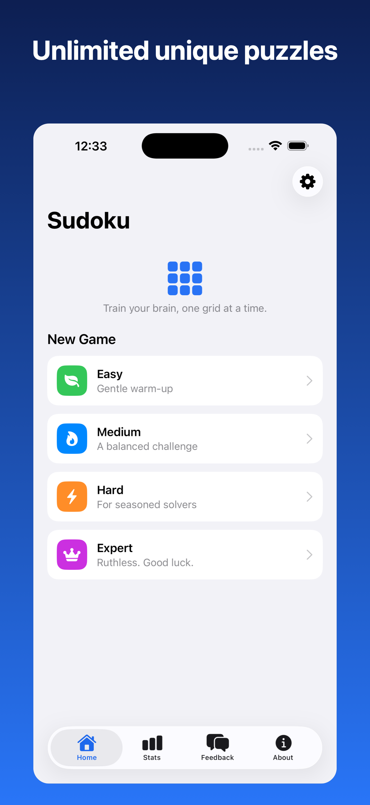
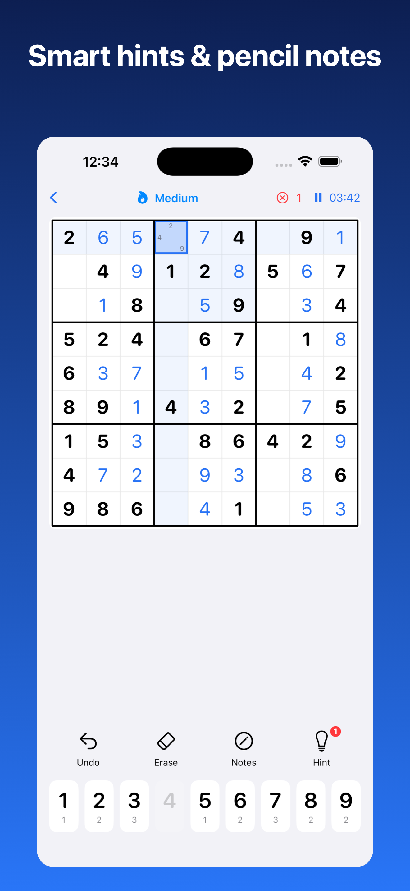
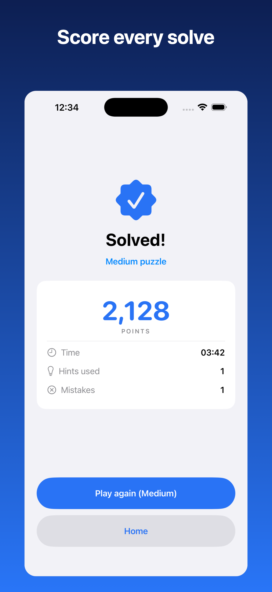

<div align="center">

# PochiDoku

[](https://www.apple.com/ios/)
[](https://swift.org)
[](https://developer.apple.com/xcode/swiftui/)
[](https://github.com/yonaskolb/XcodeGen)
[](#)

**A calm, personal Sudoku for iPhone — offline, private, and made with affection.**

[Report Bug](https://github.com/Raboys/sudokuapp/issues) · [Request Feature](https://github.com/Raboys/sudokuapp/issues)

</div>

## Screenshots

| Home | In‑game | Solved |
|:---:|:---:|:---:|
|  |  |  |

## About

PochiDoku is a native **SwiftUI** number‑puzzle game for iPhone, built to ship on the
App Store. Every puzzle is generated **on‑device** with a mathematically **guaranteed unique
solution**, including one shared puzzle for each calendar day's challenge. It's 100% offline
and private — scores, streaks, and history never leave your phone. For ages **14+**
(one‑tap confirmation, no ID or verification).

> Inspired by the Android [sudoku-mobile](https://github.com/alfredang/sudoku-mobile) app,
> rebuilt natively in Swift.

### Key features

| Feature | Description |
|---|---|
| 🎚️ Four difficulty levels | Easy / Medium / Hard / Expert (45 / 36 / 30 / 25 starting clues) |
| 📅 Daily challenge | One reproducible Medium puzzle per calendar day, generated on-device |
| 🐾 Daily streak | Consecutive completed daily challenges, stored only on this iPhone |
| 💡 Smart hints | Reveal the correct value for any cell on request — each hint affects your score |
| ✏️ Pencil notes | Candidate marks with optional auto‑cleanup of peers |
| 🎯 Highlighting | Conflict and same‑number highlighting, both toggleable |
| 🏆 Live scoring & history | Progress points in-game, completion bonus, personal bests, and honest personal percentiles |
| ❌ Three-strike games | Every puzzle allows up to three incorrect entries |
| 💾 Local storage | Scores, streaks, history and an in‑progress game saved on‑device (`UserDefaults`) |
| ⏸️ Resume | Quit any time and pick up where you left off — the Continue card shows difficulty + time |
| 🧭 Bottom navigation | Home · Stats · Feedback · About tabs; Stats keeps your scores/times one tap away |
| 💬 Feedback tab | Send feedback straight to the developers via WhatsApp |
| 📳 Haptics | Gentle feedback on entries, mistakes, and solves |
| 🔢 14+ age gate | One‑time, one‑tap age confirmation on first launch — no ID, no verification |
| 🔒 Private & offline | No network, no permissions, no tracking |

The product rules behind scoring, daily challenges, streaks, personal
comparisons, and the deferred global percentile are documented in
[`ENGAGEMENT.md`](ENGAGEMENT.md).

## Tech Stack

| Category | Technology |
|---|---|
| Language | Swift 5 |
| UI | SwiftUI (iOS 16+, iPhone, portrait) |
| Architecture | Lightweight MVVM (single `GameViewModel`) |
| Puzzle engine | Pure‑Swift generator/solver (randomised MRV backtracking + uniqueness check) |
| Persistence | `UserDefaults` (JSON) — on‑device only |
| Project generation | [XcodeGen](https://github.com/yonaskolb/XcodeGen) (`project.yml`) |
| Dependencies | None |

## Architecture

```
┌──────────────────────────── SwiftUI Views ────────────────────────────┐
│  RootView → AgeGate · MainTabView (Home · Stats · Feedback · About)     │
│           → Game (Board + NumberPad) · Completion · Settings            │
└───────────────────────────────┬────────────────────────────────────────┘
                                 │  @EnvironmentObject
                       ┌─────────▼──────────┐
                       │   GameViewModel    │   board state · timer · hints
                       │  (@MainActor OO)   │   undo · daily streak · 14+ gate
                       └───┬───────────┬────┘
              ┌────────────▼──┐   ┌────▼─────────────┐
              │  SudokuEngine │   │   ScoreStore     │
              │ generate/solve│   │ UserDefaults JSON│
              │  uniqueness   │   │ sessions+resume  │
              └───────────────┘   └──────────────────┘
```

## Project Structure

```
sudokuapp/
├── project.yml                 # XcodeGen project definition
├── SudokuApp/
│   ├── App/                    # @main entry point
│   ├── Models/                 # Difficulty, GameSession, navigation
│   ├── Engine/                 # SudokuEngine (generate / solve / uniqueness)
│   ├── Utilities/              # ScoreCalculator, ScoreStore (persistence)
│   ├── ViewModels/             # GameViewModel
│   ├── Views/                  # Root, MainTab, AgeGate, Home, Game, Board, Completion, Stats, Settings, Feedback, About
│   ├── Resources/              # Assets.xcassets (icon + accent colour)
│   └── Support/                # Info.plist, PrivacyInfo.xcprivacy
├── screenshots/                # raw captures + framed App Store images
├── scripts/                    # frame_screenshot.swift
└── .claude/skills/             # app-store-submission, ios-auto-release, app-testing + iOS design skills
```

## Getting Started

### Prerequisites

- macOS with **Xcode 16+**
- [XcodeGen](https://github.com/yonaskolb/XcodeGen): `brew install xcodegen`

### Build & run

```bash
git clone https://github.com/Raboys/sudokuapp.git
cd sudokuapp
xcodegen generate            # creates SudokuApp.xcodeproj from project.yml
open SudokuApp.xcodeproj      # ⌘R to run on a simulator or device
```

Or from the command line:

```bash
xcodebuild -project SudokuApp.xcodeproj -scheme SudokuApp \
  -configuration Debug -sdk iphonesimulator \
  -destination 'platform=iOS Simulator,name=iPhone 17' build
```

> Always edit `project.yml` (not the generated `.xcodeproj`) and re‑run `xcodegen generate`
> after adding or removing files.

## App Store Submission

This repo bundles an **App Store submission skill** (`.claude/skills/app-store-submission/`)
that drives archiving, build upload, metadata, screenshots, age rating, and review submission
via the App Store Connect API + Xcode CLI. See [`STORE_LISTING.md`](STORE_LISTING.md) for the
full listing copy and asset locations. The store age rating is **13+** (set via the API's
`ageRatingOverrideV2`); only the App Privacy label remains UI‑only.

## Privacy

100% offline. Scores and game history are stored on‑device in `UserDefaults` and are never
transmitted. See [`PrivacyInfo.xcprivacy`](SudokuApp/Support/PrivacyInfo.xcprivacy).

## License

The upstream README declares the project released under the MIT License. The upstream
repository does not currently include the full `LICENSE` file, so redistribution terms must
be confirmed before publishing PochiDoku.

## Developed By

**Raboys**

## Acknowledgements

- [XcodeGen](https://github.com/yonaskolb/XcodeGen) for project generation
- Apple's [Human Interface Guidelines](https://developer.apple.com/design/human-interface-guidelines/) and SwiftUI
- [Tertiary Sudoku](https://github.com/alfredang/sudokuapp), the original iOS project by Tertiary Infotech Pte. Ltd.
- Original Android concept: [sudoku-mobile](https://github.com/alfredang/sudoku-mobile)

---

<div align="center">

⭐ If you find this useful, give it a star!

</div>
